# 秒杀商城系统设计

## 1. 产品概述

​		秒杀是伴随着电子商务流行以来就有的一种营销模式，直白理解就是卖家以限定数量，或者限定时间，以极低的价格吸引大量的消费者关注，带动店铺整体发展的一种营销手法。由于商品价格低廉，往往一上架就被抢购一空，有时甚至只用几秒钟。

​		我完整地设计并实现了秒杀商城原型系统，包含三大部分：秒杀商城、商城管理系统和高并发秒杀业务。

##### 1.1 **秒杀商城**

​    秒杀商城是是本项目的主要部分，实现了完整的业务流程，包括用户登录、用户注册、商品列表、商品详情浏览、购物车、查看订单、用户下单、秒杀业务等功能。这些功能会在报告的最后展示。

##### 1.2 **管理系统**

​	考虑到系统设计的完整性，除了普通用户之外，还应有系统管理员，这里因为我们是B2C的业务，其中B可以认为是使用管理系统的人。其中管理系统包含了管理员注册、管理员登录、创建商品、商品管理（上架或下架）、用户管理（禁用或解禁）、订单管理（是否执行订单）。这些功能会在报告的最后展示。

##### 1.3 **高并发秒杀业务**

​	通过对网络吞吐量（TPS）进行直观的表现服务器对于并发量得性能提升，使用Redis技术、多级Cache缓存技术等技术对后端进行了优化，使得服务器并发处理的性能得到了几倍得性能提升。

## 2. 建模

##### 2.1 UML建模

​		从整体来看，有两类用户：顾客和机构管理员，他们均可以继承User类，机构管理员可以有旗舰店的控制权限，可以创建多个商品，用户则可以在主页看到发布的商品进行下单或购物车等操作，同时如果出现缺货等情况旗舰店可以取消订单等。可以采用**类图**的形式描述秒杀商城的实体关系：

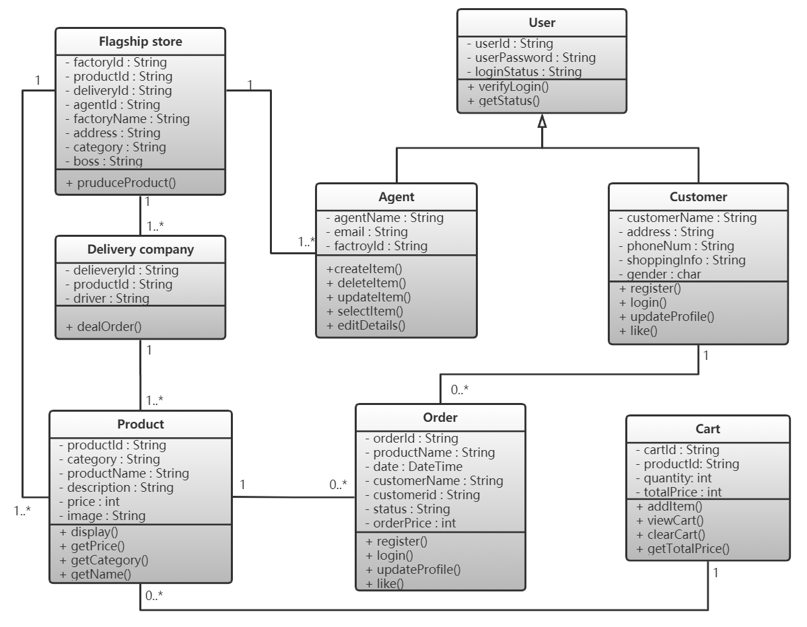

​		也可以使用顺序图来描述业务流程。图中描述了用户的可以进行的一些业务操作，对于管理员来说，他的管理功能都是比较明显而且没有明显的时序关系，这里省略。

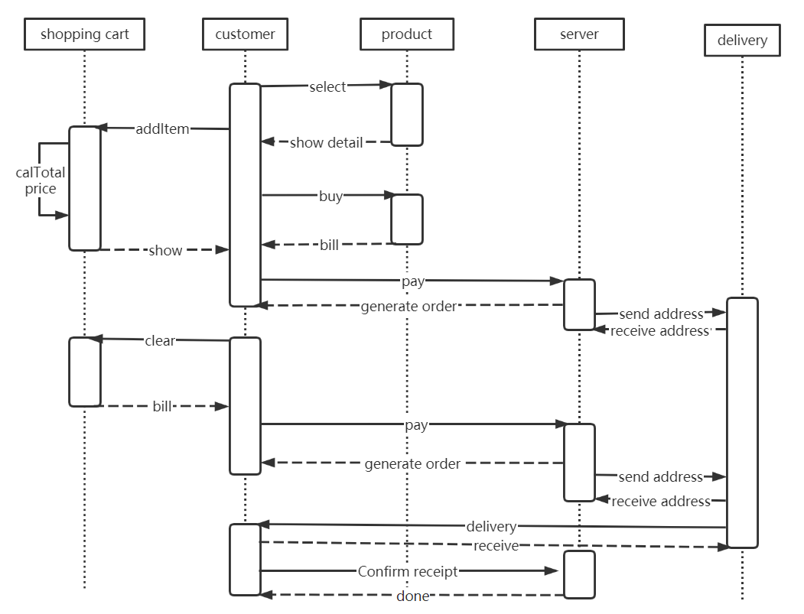

##### 2.3 数据库E-R图建模

* cart_item：购物车商品列表，可以根据用户id找到添加进购物车的商品id
* item：商品列表，包含了商品信息
* item_stock：商品库存表，商品id与库存量一一对应

* order_info：订单信息表，包含了订单的全部信息
* promo：秒杀活动表，包含了商品秒杀的时间和秒杀价格等
* sequence_info：生成唯一的订单号
* user_info：用户信息表，包含了个人账号与身份等信息
* user_password：用户密码加密后单独存储，保证数据安全性与隐私性

​		数据库的E-R图如下所示：

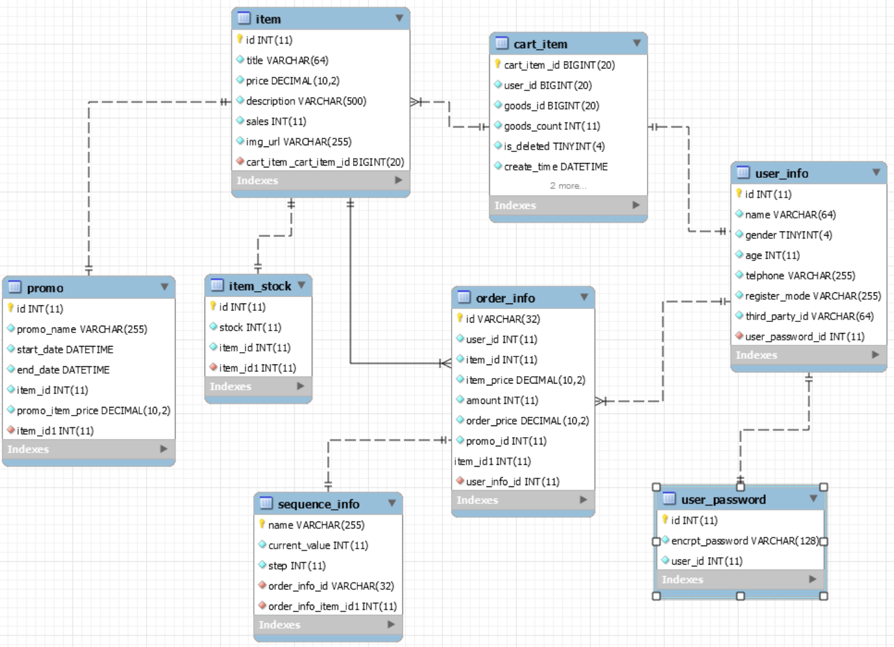

## 3 项目架构

​		使用了MVC（Model-View-Controller）的设计模式，底层用的SpringBoot框架，将业务逻辑、数据、界面显示分离的方法组织代码，将业务逻辑聚集到一个部件里面，在改进和个性化定制界面及用户交互的同时，不需要重新编写业务逻辑。

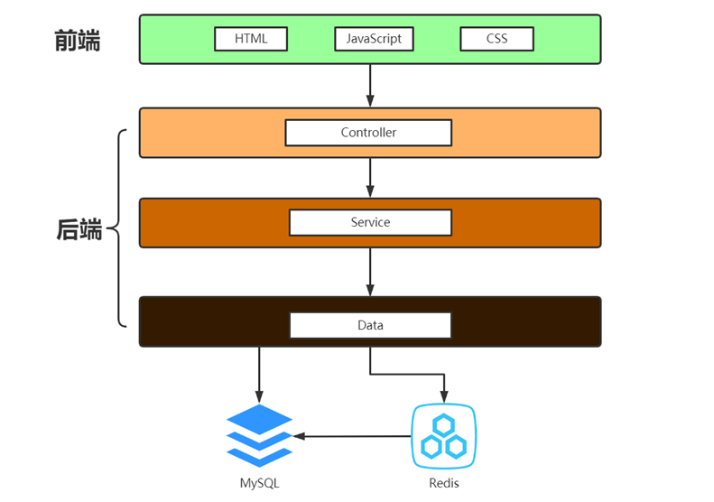

## 4. 项目演示

项目部署在本机8080端口，输入localhost:8080，即可访问商城主页（长截图）

上方为网页头，所有的页面中都会有这个头，相当于导航栏的作用，下方为网页尾，主要是一些声明

中部为商城主页，所有商品的信息都在这里，目前只有6个商品

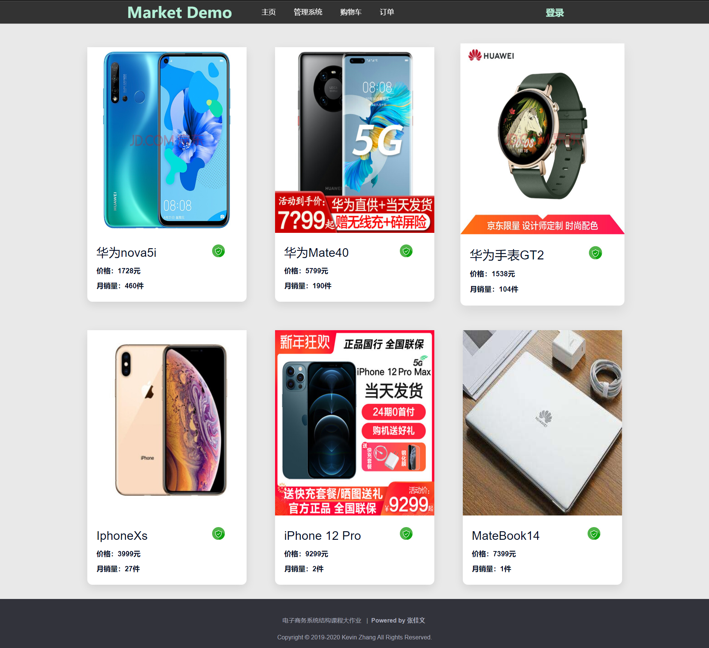

点击某个商品框，可以进入商品详情页

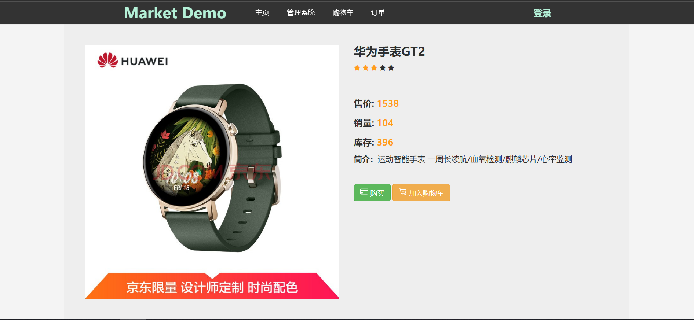

刚进入的时候还未登录，此时点击下单是不可行的，会提示错误信息，点击确定之后会自动跳转到登陆页面

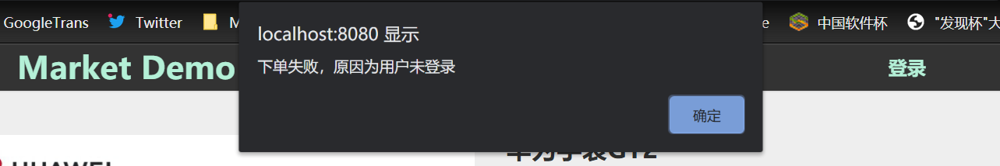

这是登录页的UI，用户如果无账号可以点击注册，有账号直接输入账号密码登陆即可

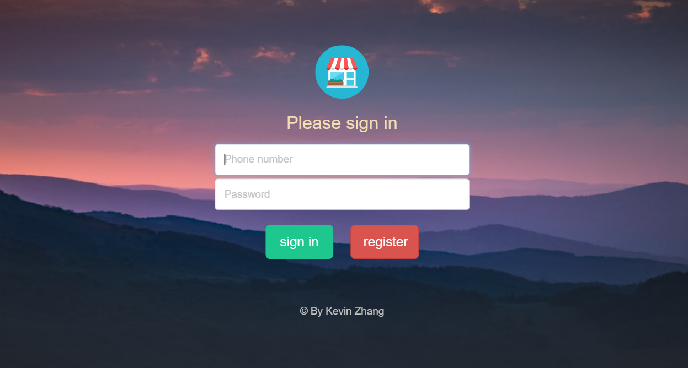

登录成功后，HTML头的右侧原有的“登录”字样换成了当前用户的用户名Kevin，此时点击下单，即可完成下单，这里后续可以加入支付二维码页面

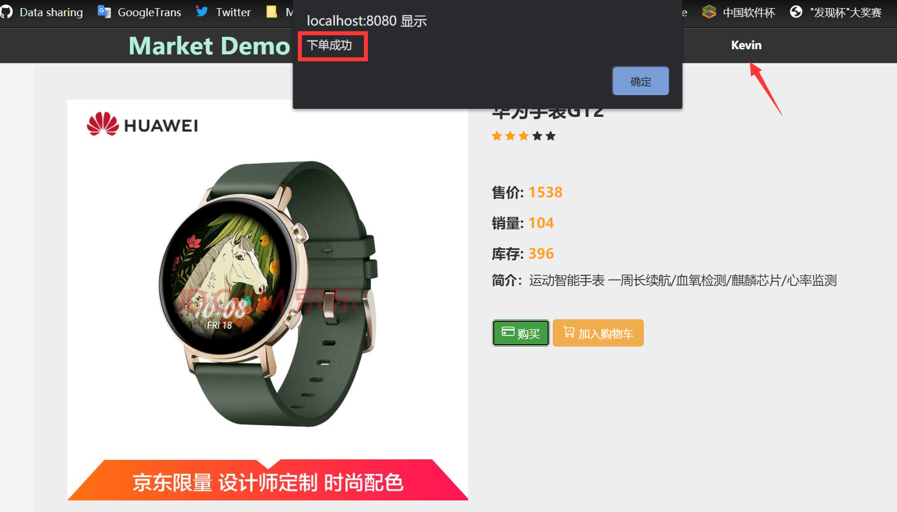

下单成功之后可以点击订单查看我的订单，订单页面可以看到自己的购物记录，包括订单号，实付金额等等

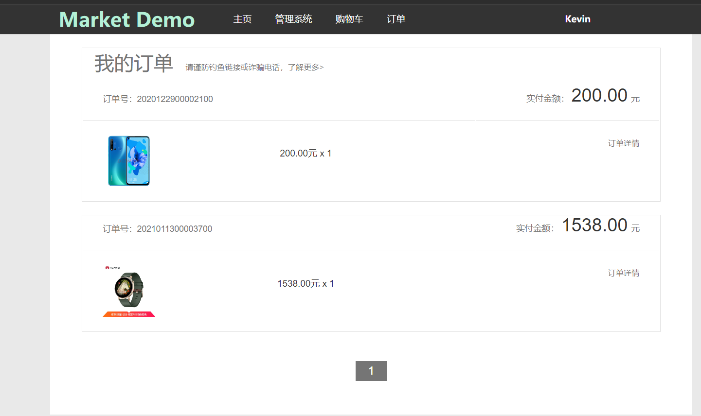

这里展示商品秒杀的业务，我们新建秒杀活动，设置华为Mate40这个商品在2021年1月13日 21:20:00开始秒杀活动，原本的售价是5799（当前时间还未秒杀时间），设置秒杀的售价是4799元。

此时的时间是2021年1月13日 21:19:00，此时离秒杀开始还有一分钟，会出现秒杀倒计时。

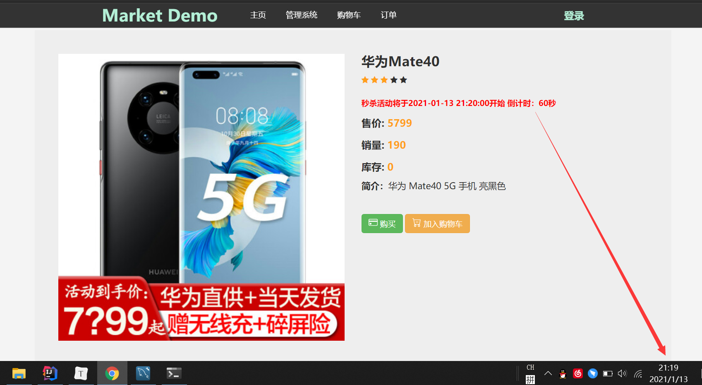

此时是2021年1月13日 21:21:00秒杀活动已经开始，显示秒杀活动正在进行，而且售价变成了秒杀价格4799

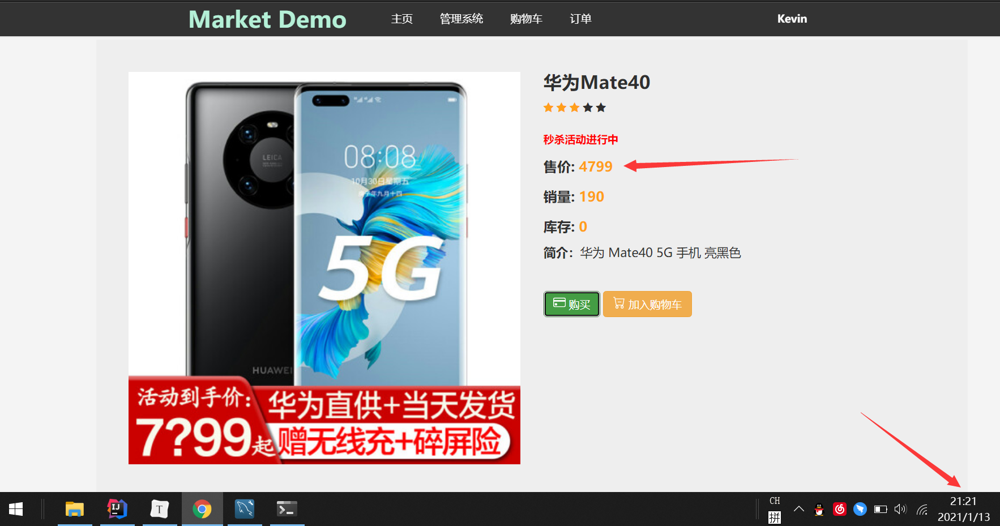

除了用户的购物系统，还有管理系统，点击进入之后，输入管理员的账号和密码即可进入商城管理系统，这是管理系统主页

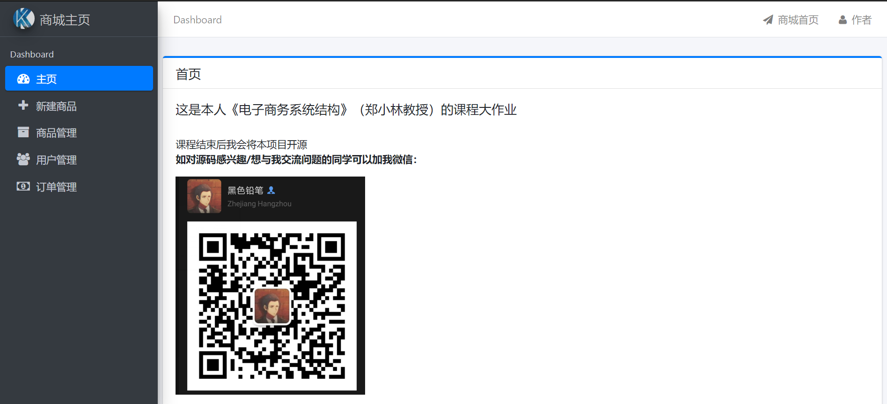

可以在管理系统中关键商品，输入创建商品的信息，点击创建即创建成功。

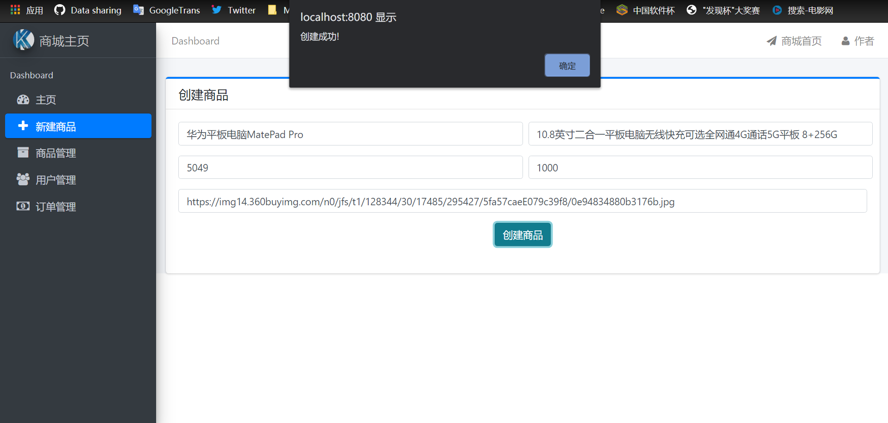

验证商品创建，即进入商城主页，可以看到我们刚刚创建的商品。

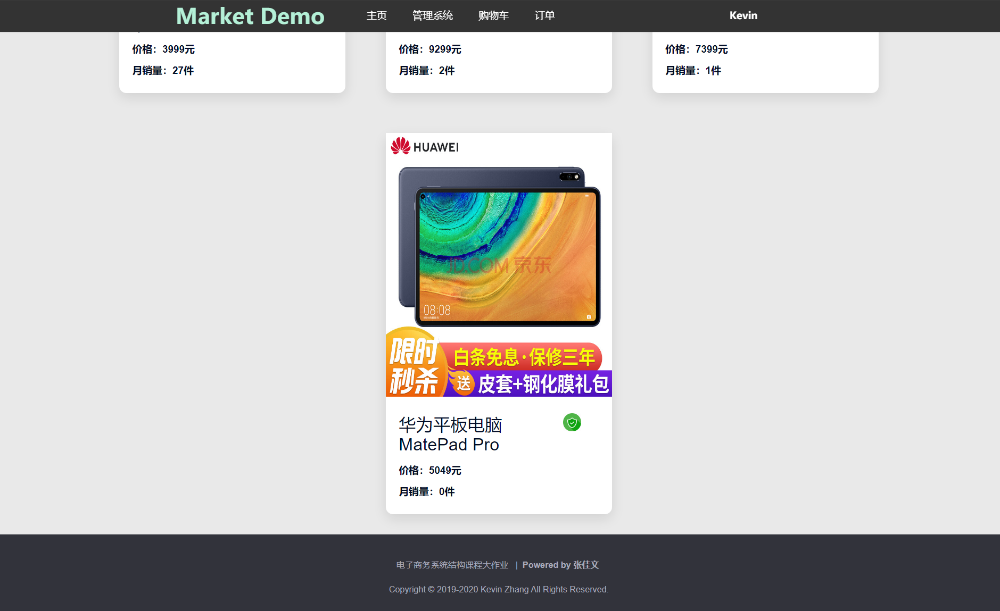

除此之外还实现了商品管理页面，选中商品可以进行上架和下架的处理，下架之后商品将不再出现在商城主页，点击上架之后恢复，在这个页面能看到商品的几乎所有信息。

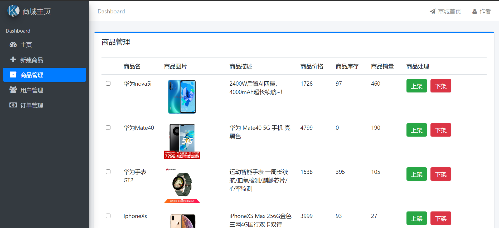

这是用户管理的页面，逻辑与商品管理差不多，对于有些违规的用户，可以对用户账号进行禁用。

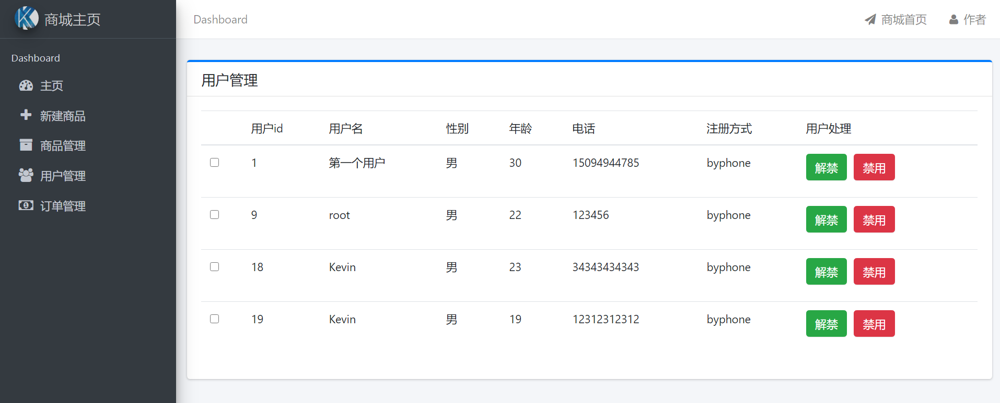

用户下单之后，考虑到用户的退款诉求或是商品缺货，那么在订单管理页面可以对对应的订单进行删除，并且完成退款操作，整个流程看作一个事务。

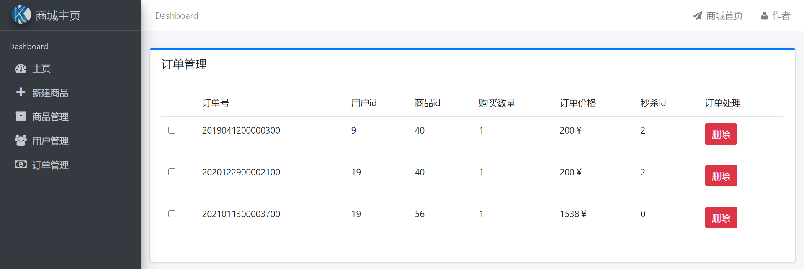

删除刚刚样例中下单的订单，该订单被删除

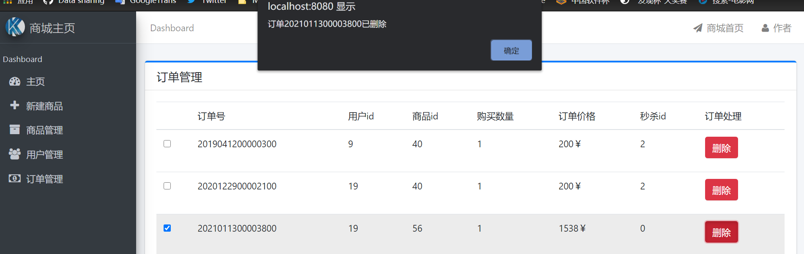

订单删除后再次回到该用户的订单查看页面，可以看到此时订单中刚刚的那笔订单已经被取消

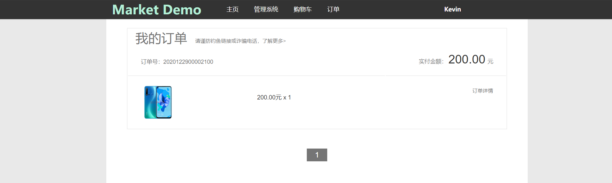

