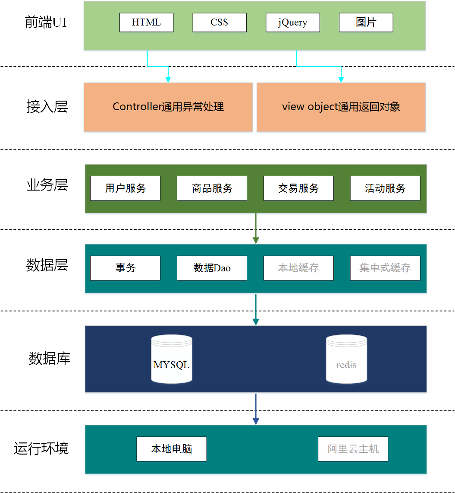
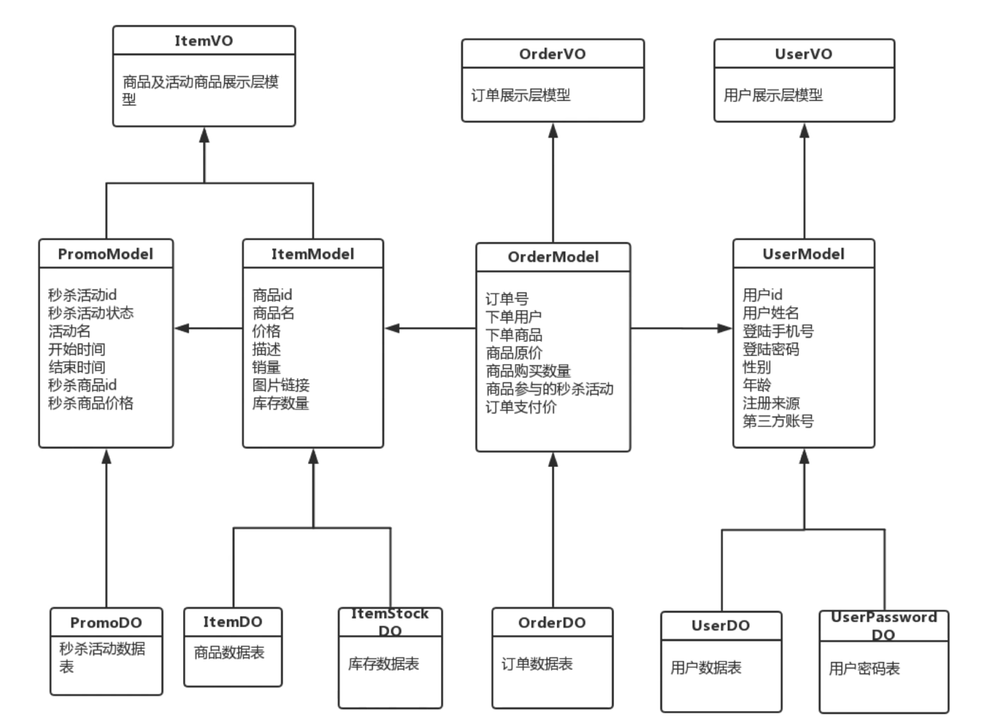
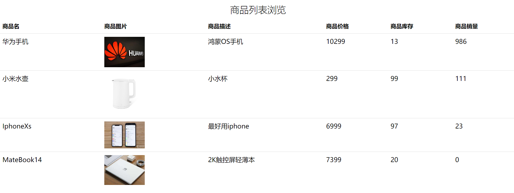
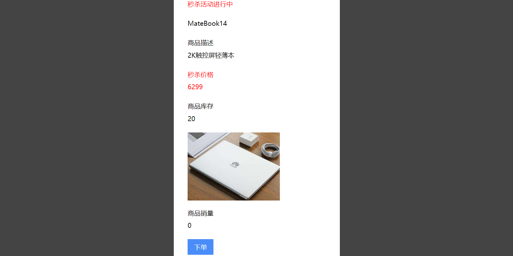

# seckill
基于SpringBoot, SpringMVC, Mybatis的电商秒杀购物项目，采用前后端分离的模式，前端套用Metronic模板
### 项目架构: 

 

### 底层设计及领域模型设计：从上至下依次被Controller,Service,Database层调用

 

### 待更新

* 查询优化: redis多级缓存

* 分布式扩展: nginx，token

* 防刷限流

 

### 项目展示

* 登录/注册

 

* 商品列表，待美化

 

* 商品详情，在秒杀时段可以低价购买

